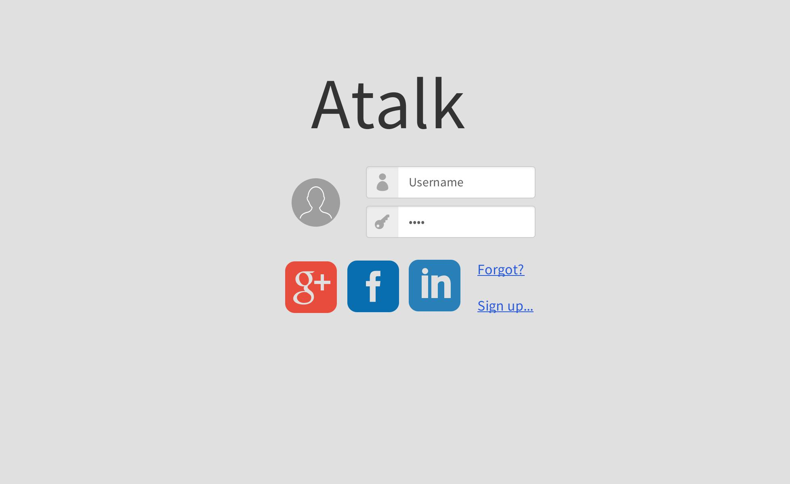
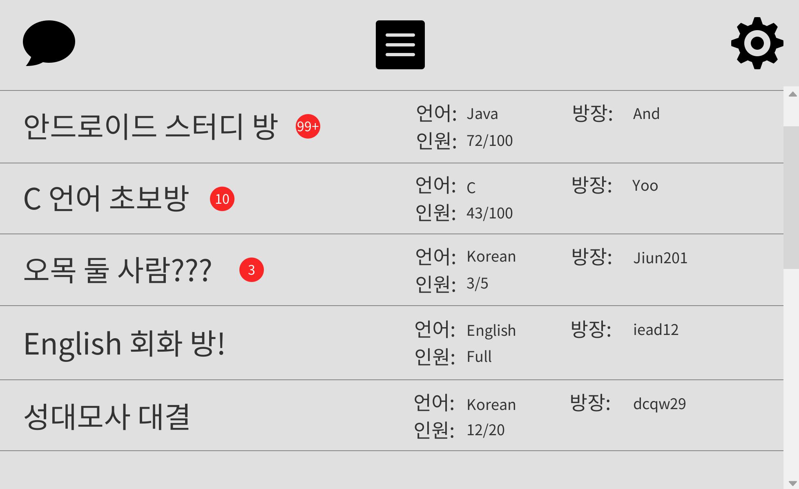
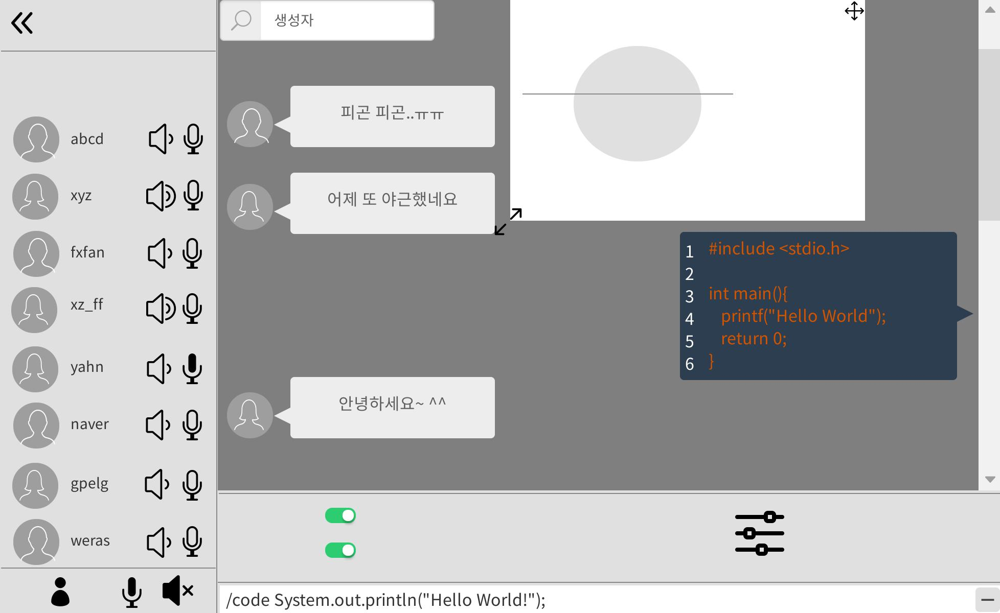
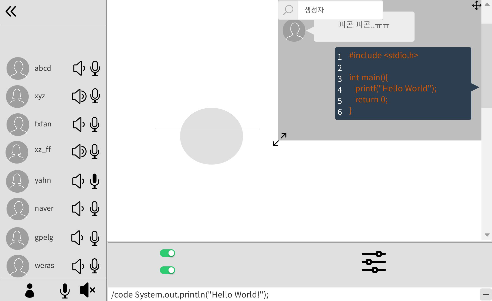
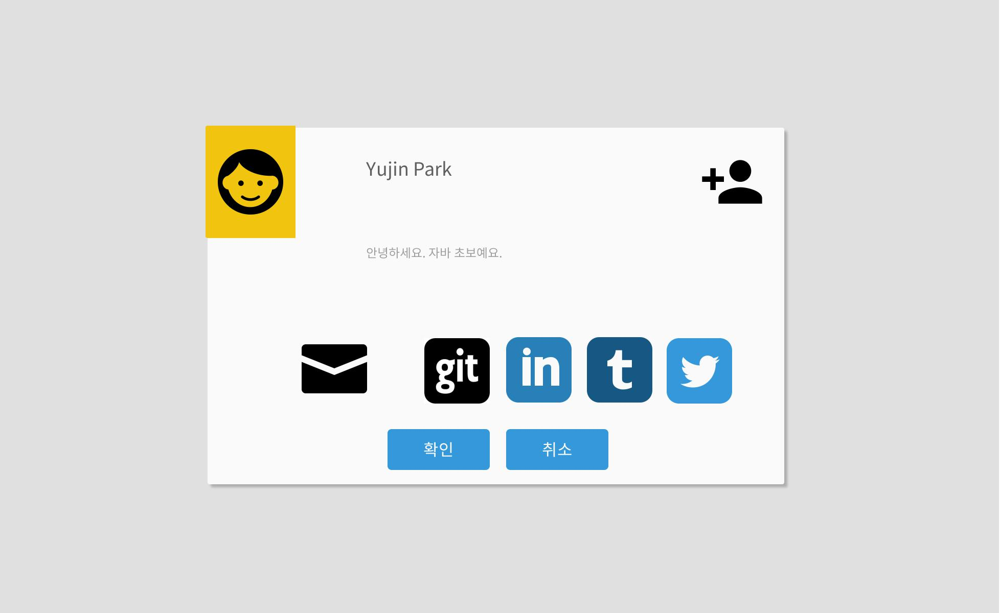
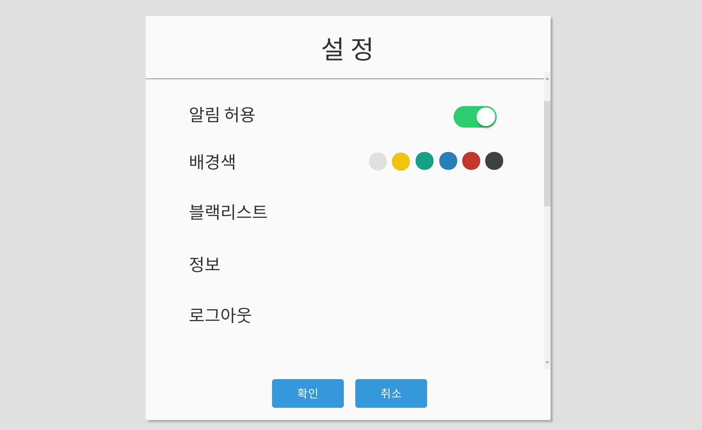
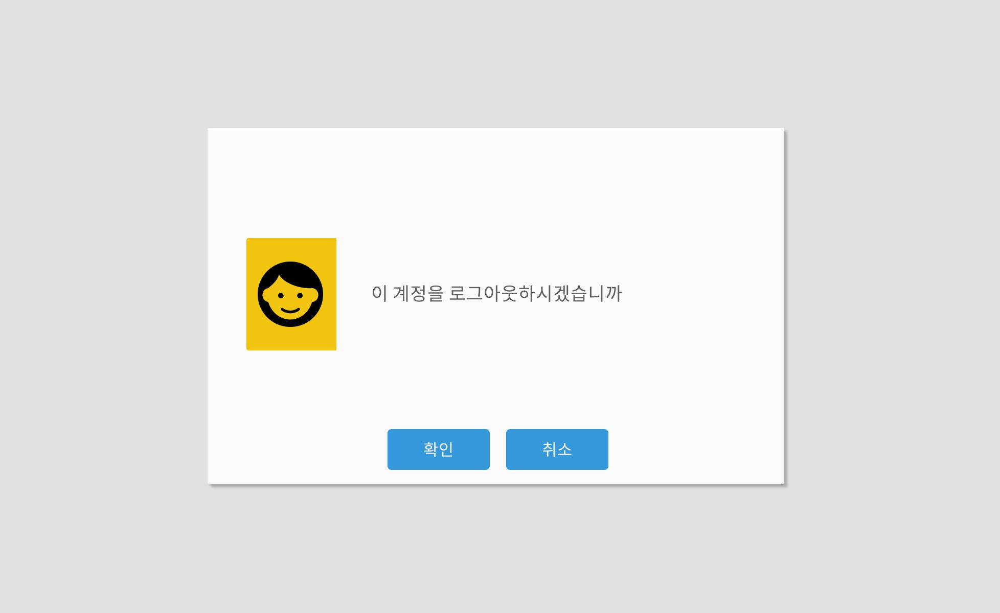
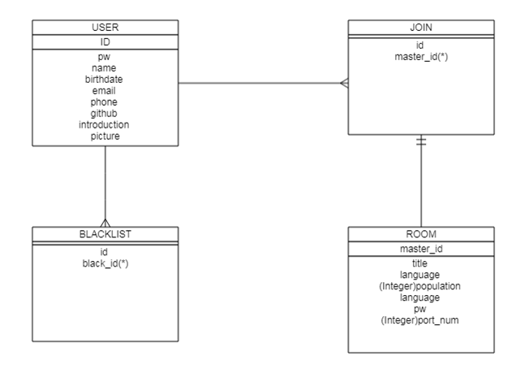
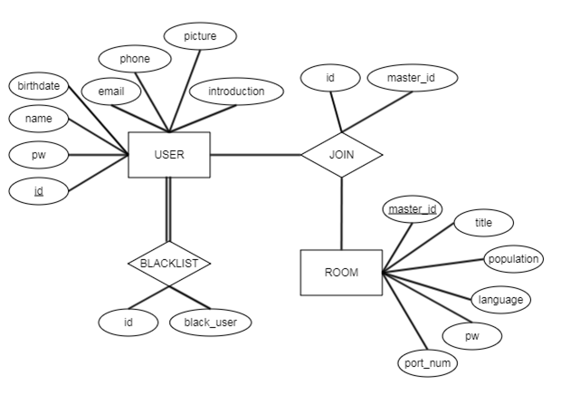
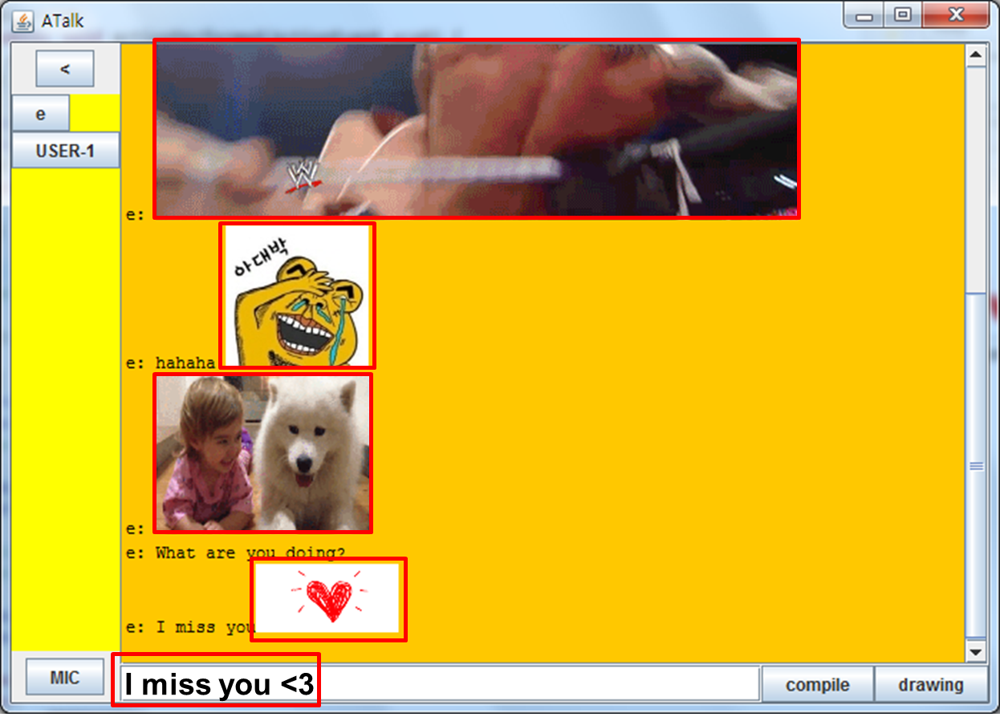

# 스마트문화콘텐츠 웹 & 앱개발 과정, 첫 프로젝트 #
[과정 Summary 보기](https://chanjungkim.github.io/study/androidstudy/)
* ##### 3팀
* ##### 팀장: [김찬중](https://www.linkedin.com/in/chanjungkim/)
* ##### 팀원: [장진영](https://github.com/jinyoung1105), [최정호](https://github.com/odoria), [홍준완](https://github.com/hongjunwan) 
* ##### 주제: (프로그래머 / 직장인을 위한) 채팅 프로그램
* ##### 사용 언어: JAVA
* ##### 프로젝트 기간: 2017년 8월 7일 ~ 미정 (한 달 예정)

#### 1차 회의
* 날짜: 2017. 08. 07
* 주제: 첫인사 그리고 아이템 정하기 - 무엇을 만들까?
* 내용:
> 1. (너무 간단하게 대충 만들지 않고) 나중에 도움이 되도록 여러가지 만들어 보고 싶다.
> 2. 작업량이 비슷하게 분배하자.
> 3. DB는 들어가야한다.
> 4. 회원가입, 로그인, 게시판 정도는 만들어야하지 않을까?
> 5. 채팅? 괜찮다.
> 6. 회사원을 위한 채팅? 프로그래머를 위한 채팅?
> 7. 컴파일 기능, 동시 그리기 작업가능(캐치 마인드 같은), 통화말고 ON/OFF 음성 통신(DISCORD 같이), 명령어 기능(ex. /play music), 코드 전용 메시지
* 결과
> - [X] 완료

#### 2차 회의
* 날짜: 2017. 08. 11
* 주제: 휴일 보내기
* 내용: 
> * 공통: Swing 살짝 훑어보기 v
> * 김찬중: (그림판 가능)생각한 디자인 가져오기 + 명령어, 그림 공유 등 조사 v
> * 최정호: (친구가 DB 좀 앎) DB 공부하고 오기 v
> * 홍준완: (Swing 좀 만들어봄(퍼즐게임)) 로그인 만들어 보기 v
> * 장진영: 컴파일러 알아보기 v
* 결과
> - [X] UI: https://goo.gl/zCYAQd

#### 3차 회의
* 날짜: 2017. 08. 22
* 주제: UI 회의
* 내용: 
> * 로그아웃, 설정 화면이 필요함.
> * 한 Frame으로 구성하기보다 여러 프레임으로 창이 바뀌도록 하는 게 낫다. 프로필과 설정 창은 다이얼로그로 시도.
> * Google, Facebook 로그인 구현은 하지말자.
> * Github 가입, Github Desktop 설치, 공동 프로젝트 Repository생성(ATalk) 및 Collabrators로 추가
* 결과
> - [X] 완료

#### 4차 회의
* 날짜: 2017. 08. 25. 
* 주제: Github 사용방법 및 레이아웃 만들기
* 내용:
> * 공통: Github 사용방법(Desktop로 Repository가져오기, Push 및 Pull하기, 주의점, 개인 웹사이트 만들기) , 레이아웃 하나씩 맡기.
> * 김찬중: 채팅 화면 v
> * 최정호: 채팅방 목록 v
> * 홍준완: 로그인 v
> * 장진영: 프로필, 설정 v
* 결과

> - [X] 완료

#### 5차 회의
* 날짜: 2017. 08. 29.
* 주제: 기본 기능 넣기
* 내용: 
> * 공통: 일 분배가 애매하니 시간이 나는대로 작업하기.
> * 김찬중: 로그인 기능, 채팅(Multicast)
> * 최정호: 예비군...
> * 홍준완: 설정 만들기, 블랙리스트
> * 장진영: 컴파일
* 결과
> - [X] 완료

#### 6차 회의
* 날짜: 2017. 09. 05.
* 주제: 중간 검토
* 내용
> 1. 컴파일 기능을 만들었다. 입력 및 결과출력만 가능. -> 에러도 나오게 하자.
> 2. DB를 어떻게 할까?(회원-<입장>-방목록, 회원-<블록>-회원)?  -> Use-case Diagram, 간트차트도 만들고, ER-Diagram을 만들어보자.
> 3. 음성 채팅 -> 좀 더 조사, 그림 -> 동시 그리기 대신 그려서 파일로 보내기?
> 4. 리스트뷰(방 생성/삭제, 방 입장/퇴장 시)를 스윙으로 어떻게 표현할 수 있을까?
> 5. 서로 일이 꼬이지않게 카톡방에다가 시작(~부분 하겠다.), 끝(~했다.), 해결하지 못하거나 해결해야할 부분을 모든 멤버가 알도록 알리거나 수업 시간엔 말이라도 해서 알려주기

* 결과
> - [X] 완료

#### 7차 회의
* 날짜: 2017. 09. 07.
* 주제: 중간검토
* 내용
> 1. 드로잉 기능 완료 -> 멀티 채팅에서 다른 사람과 같이 그릴 수 있게 만들자.
> 2. DB는 MEMBER, BLACKLIST, JOIN, ROOM 으로 구분하자. -> DB는 팀원이 4명이니까 공부할 겸 한 명씩 맡아서 하자.
> 3. 방을 생성하면 ROOM에 방정보가 들어가고 JOIN에 방 정보와 멤버 정보가 들어감
> 4. 음성채팅은 보류. 멀티 채팅에 전념하기.
* 결과

> - [X] 완료

#### 8차 회의
* 날짜: 2017. 09. 10.
* 주제: 중간검토
* 내용:
> 1. 회원 가입 DB연동 완료
> 2. RoomList에서 방 ListView형식으로 만들기 완성 -> UserList도 해보자.
> 3. 컴파일 레이아웃 수정.
> 4. 드로잉 계속 버그남
> 5. 이모티콘 넣어보자
> 6. BlackList 기능 완료 -> DB 작업
* 결과
> - [X] 완료

#### 9차 회의
* 날짜: 2017. 09. 12
* 주제: 중간검토
* 내용
> 1. 서버 구축 대강 완료: Main서버를 두고 ServerThread와 DrawingServerThread로 나눔. 하지만 DrawingServerThread는 미완료
> 2. BLACKLIST 연동 완료 -> 상대방 차단하는 방법 알아보기
> 3. 이모티콘 완료
> 4. DrawingServerThread 대강 완료 -> 동시 작업 시 에러
* 결과

> - [X] 완료

#### 10차 회의
* 날짜: 2017. 09. 14
* 주제: 발표 어떻게 할까
* 내용
> 1. PPT작성 -> 작업한 사람 별로 기능 나눠서 작성하자
> 2. 발표 -> 연습한다치고 같이 파트 나눈대로 발표하자
* 결과
> - [X] 완료

#### 1차 프로젝트 기간은 끝났지만, 앞으로도 쭉... To be continued.
